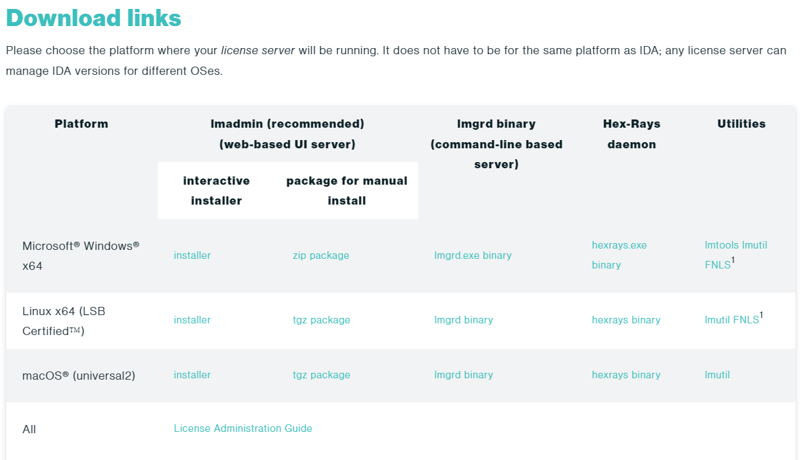
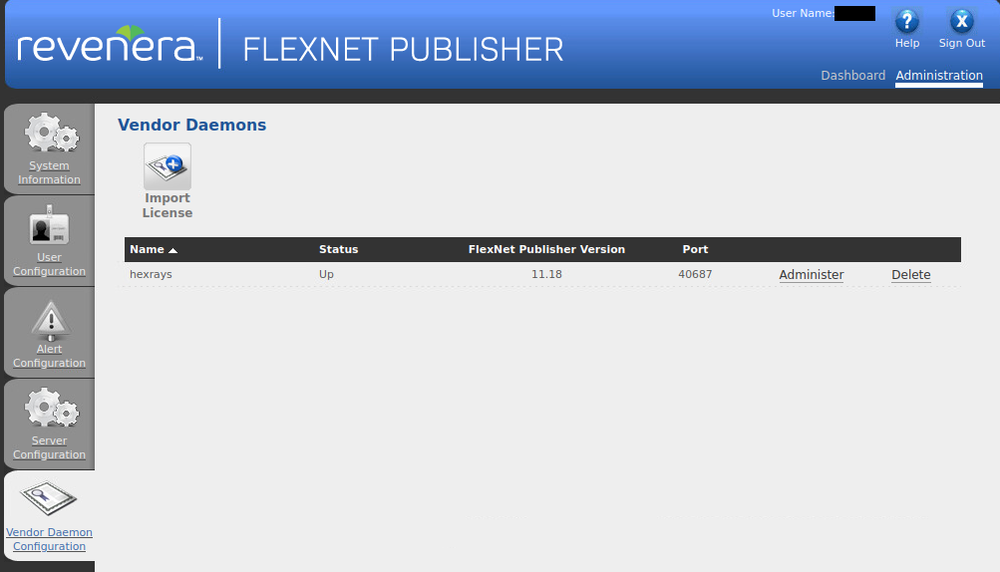

# IDA Installation
## Necessary file
You can download file on Hex-Rays offer the [download link]
- Main installer _**idaprofl_hexarm64fl_XXX.run**_
- license file _**ida.lic**_
- web-based UI server _**lmadmin.bin**_
- Hex-Rays daemon _**hexrays.bin**_
</img>
## Install main program
    ./idaprofl_hexarm64fl.run
During installing, you should input "installation password"
</img>
You can find password in e-mail
</img>
## Import license
### Install license server
Require java  
```commandline
sudo apt-get install openjdk-XX-jre-headless
```
Second execute *lmadmin.bin* file    
```commandline
./lmadmin-x64_lsb-XX_XX_X_X.bin
```
### Starting server
1. starting web UI
    ```commandline
    /opt/FNPLicenseServerManager/lmadmin
     ```
2. Move *hexrays.bin* to "FNPLicenseServerManager" directory
3. Open browser *127.0.0.1:8090*(Default port 8090), and consider security, 
  should Enable HTTPS
4. Under *Vendor Daemon* page, import license *ida.lic*
</img>
### Starting main program
```commandline
~/idapro-X.X/ida64
```
